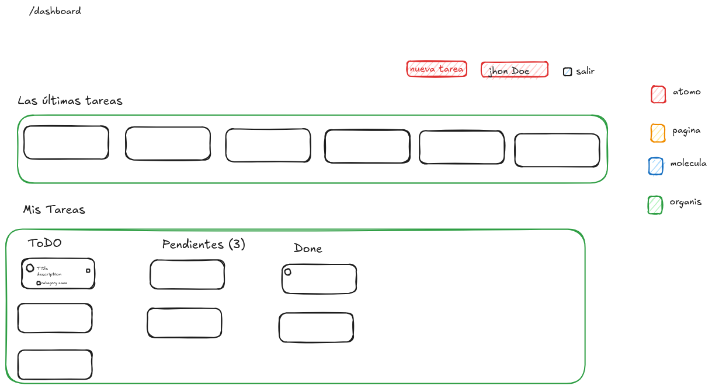
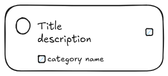

# Architecture

This document outlines the architecture of the TODO Frontend application, detailing its structure, components, and technologies used.
## Overview
The TODO Frontend application is built using modern web technologies to provide a responsive and user-friendly interface for managing tasks. The application follows a component-based architecture, allowing for modular development and easy maintenance.
## Technologies Used
- **React**: A JavaScript library for building user interfaces.
- **Vite**: A build tool that provides a fast development environment.
- **TypeScript**: A superset of JavaScript that adds static typing.

## Application Structure
The application is organized into the following main directories:
- **src/**: Contains the source code of the application.
    - **components/**: Reusable UI components.
        - **molecules/**: Composite components made up of atoms.
        - **organisms/**: Complex components made up of molecules and atoms.
        - **ui/**: Basic building blocks of the UI.
    - **pages/**: Different pages of the application.
    - **services/**: API service calls.
    - **providers/**: Context providers for state management and theming.
    - **routes/**: Application routing configuration.
    - **services/**: API service calls.
    - **stores/**: State management using Zustand.
    - **types/**: TypeScript type definitions.

## 
Component Hierarchy
### login components

### dashboard components

### card components
